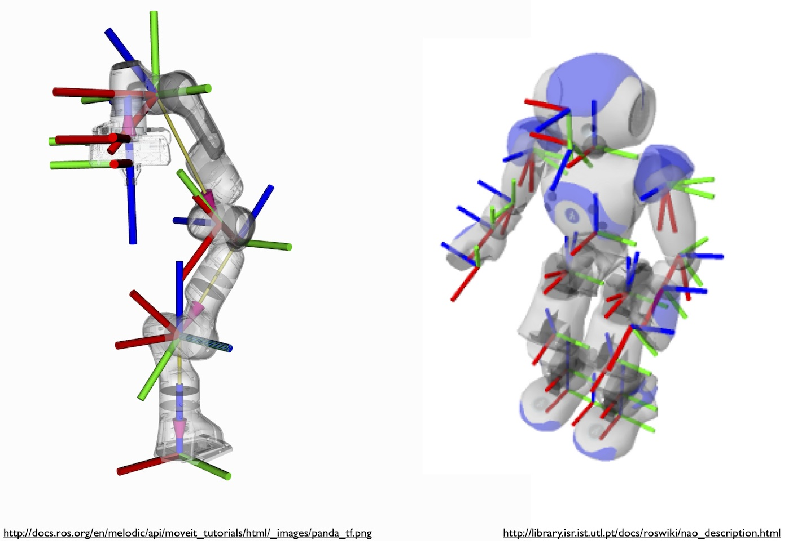

## Introduction to Kinematic Chains

A kinematic chain is a hierarchical arrangement of rigid bodies connected by joints. The chains are used for representing articulated objects such as robots and skeletons. Mathematically, the chain is a set of multiple local coordinate frames where the pose of each frame is represented with respect to pose of its predecessor frame, i.e., the pose of frame $\mathcal F_{i}$ is given with respect to the pose of frame $\mathcal F_{i-1}$.  Figure 1 shows two examples of articulated objects and their kinematic chains. 

**Figure 1**: Two examples of kinematic chains.

 
