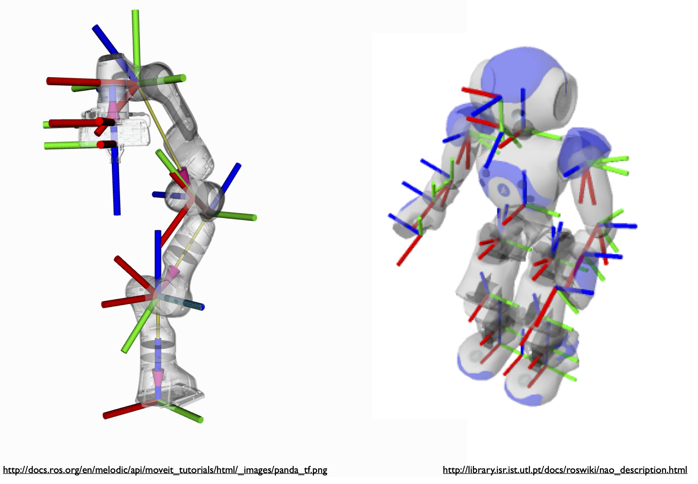

## Introduction to Kinematic Chains

Kinematic chains are hierarchical structures used for representing articulated objects such as robots and skeletons. Mathematically, the chain is a hierarchical arrangement of local coordinate frames where the pose of each frame is represented with respect to pose of its predecessor frame, i.e., the pose of frame $\mathcal{F}\{i\}$ is given with respect to the pose of frame $\mathcal{F}\{i-1\}$.  Figure 1 shows two examples of articulated objects and their kinematic chains. 

**Figure 1**: Two examples of kinematic chains.

 
