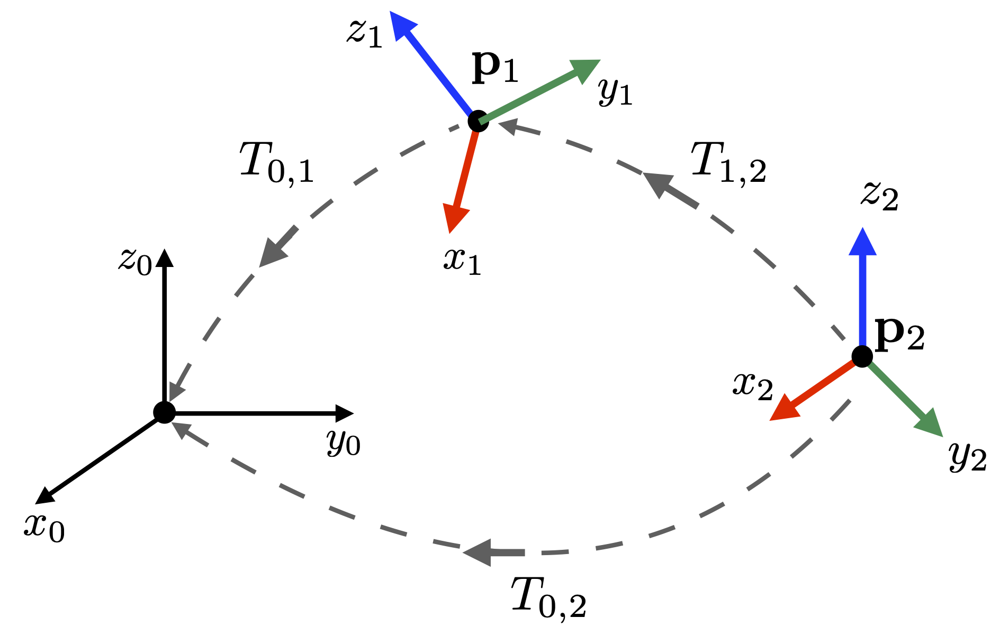

## Introduction to Kinematic Chains

A kinematic chain is a hierarchical arrangement of rigid bodies connected by joints. The chains are used for representing articulated objects such as robots and skeletons (Figure 1). 

**Figure 1**: Kinematic chains modeling the articulation in a human body. The chain's main components are the links and the joints. 

Mathematically, the chain can be modeled as a set of multiple local coordinate frames, where each frame $\mathcal F_{i}$ has its pose (i.e., spatial location and orientation) represented with respect to pose of its predecessor frame $\mathcal F_{i-1}$. Figure 2 shows two examples of articulated objects and their kinematic chains modeled as an assembly of local 3-D coordinate systems. 

**Figure 2**: Two examples of kinematic chains.

#### Overview 

The pose of a coordinate frame is written with respect to another coordinate system using a rigid-body transformation, i.e.:

**Figure 3**: Three coordinate systems  $\mathcal F_{0}$, $\mathcal F_{1}$, and  $\mathcal F_{2}$.   $\mathcal F_{0}$ is the global (i.e., standard or canonical system). The other two systems are local coordinate systems that can be represented with respect to the global coordinate system and also with respect to one another. The choice of representation depends on the problem that needs to be solved.

#### 

 
