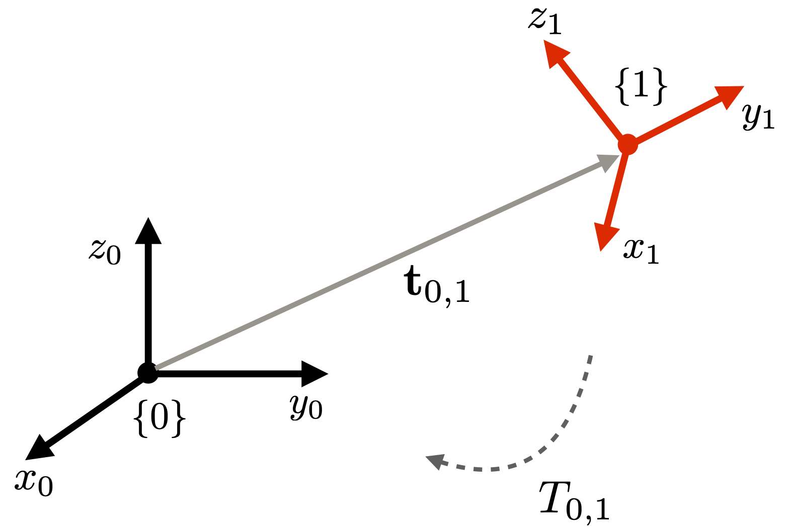

## Introduction to Kinematic Chains

A kinematic chain is a hierarchical arrangement of rigid bodies connected by joints. The chains are used for representing articulated objects such as robots and skeletons (Figure 1). 

**Figure 1**: Kinematic chains modeling the articulation in a human body. The chain's main components are the links and the joints (Figure from https://www.rosroboticslearning.com/forward-kinematics). 

Mathematically, the chain can be modeled as a set of multiple local coordinate frames, where each frame $\mathcal F\{i\}$ has its pose (i.e., spatial location and orientation) represented with respect to pose of its predecessor frame $\mathcal F\{i-1\}$. Figure 2 shows two examples of articulated objects and their kinematic chains modeled as an assembly of local 3-D coordinate systems. 

**Figure 2**: Two examples of kinematic chains.

#### Relating multiple coordinate frames

##### Two frames

A (local) coordinate system can be written with respect of the global coordinate system and also with respect to any other coordinate system that we create. Consider, for instance, the two coordinate frames shown in Figure 3. In the figure, there are two frames, i.e., frame $\mathcal F\{0\}$ and frame $\mathcal F\{1\}$. Frame $\mathcal F\{0\}$ is the world frame (or global frame) and frame $\mathcal F\{1\}$ is a local frame. 

**Figure 3**: Two coordinate systems $\mathcal F\{0\}$ and $\mathcal F\{1\}$.  $\mathcal F\{0\}$ is the global system, also known as standard or canonical system. The other system is represented with respect to the global coordinate system.

The two coordinate frames in Figure 3 are related by a rigid-body transformation, which includes a rotation followed by a translation. We can think of frame $\mathcal F_{1}$ as being  initially aligned with frame $\mathcal F_{0}$, and then moved to a new position (and orientation) in space by the transformation $T_{0,1}$, which is written as:
$$
\begin{align}
          T_{0,1} &= 
           \begin{bmatrix}
           	 R_{0,1} &{\bf t}_{0,1} \\
                 {\bf 0} & 1 
           \end{bmatrix}.      
	\label{pose}
\end{align}
$$

Here, $R_{0,1}$ is a rotation matrix, and ${\bf t}_{0,1}$ is the translation (i.e., displacement) of frame $\mathcal F\{1\}$'s origin. We can also think of the matrix in Equation $\ref{pose}$ as the matrix representing frame $\mathcal F\{1\}$ or the pose of $\mathcal F\{1\}$ w.r.t. $\mathcal F\{0\}$.

Conversely, to obtain the pose of $\mathcal F\{0\}$ with respect to $\mathcal F\{1\}$ , we calculate the inverse transformation (i.e., the inverse of the matrix in Equation $\ref{pose}$, which is written as:
$$
\begin{align}
          T_{1,0} =  T_{0,1} ^{\,-1} = 
           \begin{bmatrix}
           	 R^\mathsf{T}_{0,1} & -R^\mathsf{T}\,{\bf t}_{0,1} \\
                 {\bf 0} & 1 
           \end{bmatrix}.      
	\label{poseInverse}
\end{align}
$$

##### Multiple frames

We can extend extend the concept of local frames to multiple (local) frames as shown in Figure 4. The figure shows three coordinate frames: $\mathcal F\{0\}$, $\mathcal F\{1\}$, and  $\mathcal F\{2\}$.

**Figure 4**: Three coordinate systems  $\mathcal F_{0}$, $\mathcal F_{1}$, and  $\mathcal F_{2}$.   $\mathcal F_{0}$ is the global, also known as standard or canonical system. The other two systems are local coordinate systems that can be represented with respect to the global coordinate system and also with respect to one another. The choice of representation depends on the problem to be solved.

In the case of multiple frames, we can create a number of different relationships between the various frames. Again, the choice of relationships to use will depend on the application or problem to be solved. 

When multiple frames are involved, it is useful to combine transformations to form new ones. We can also change reference frames to represent an object's pose at multiple locations. 

In Figure 4, transformation $T_{0,1}$ is the pose of $\mathcal F_{1}$ with respect to $\mathcal F_{0}$, and $T_{1,2}$ is the pose of $\mathcal F_{2}$ with respect to $\mathcal F_{1}$. Interestingly, we can combine the two consecutive transformations to obtain the pose of $\mathcal F_{2}$ with respect to $\mathcal F_{0}$. Thus,  $\mathcal F_{2}$, expressed in terms of $\mathcal F_{0}$ is given by:

$$
\begin{align}
           T_{0,2} &= T_{0,1}T_{1,2} =   
           \begin{bmatrix}
           	 R_{0,1} &{\bf t}_{0,1} \\
                 {\bf 0} & 1 
           \end{bmatrix}
           \begin{bmatrix}
           	 R_{1,2} &{\bf t}_{1,2} \\
                 {\bf 0} & 1 
           \end{bmatrix} = 
                      \begin{bmatrix}
           	 R_{0,2} &{\bf t}_{0,2}\\
                 {\bf 0} & 1 
           \end{bmatrix}.                      
	\label{pose1}
\end{align} 
$$

Note that we can also move in the reverse direction. For example, we can obtain the pose of frame 0 with respect to frame $\mathcal F_{2}$ by "moving" in the reverse direction, i.e.: 

$$
\begin{align}
           T_{2,0} &= T_{0,2}^{\,-1} = T_{1,2}^{\,-1}T_{0,1}^{\,-1} =   T_{2,1}T_{1,0}.                   
	\label{pose2}
\end{align} 
$$

This recursive-composition approach works for any number of coordinate frames.  Equation $\ref{frames}$ shows an example of composing transformations for a set of six coordinate frames, each one represented with respect to its predecessor, where frame 0 is the world reference frame.

$$
\begin{align}
%          T_{0,1} &= 
%           \begin{bmatrix}
%           	 R_{0,1} &{\bf t}_{0,1} \\
%                 {\bf 0} & 1 
%           \end{bmatrix}, \notag\\
          T_{0,1} &= T_{0,1}. \notag\\            
          T_{0,2} &= T_{0,1}T_{1,2}. \notag\\            
           T_{0,3} &= T_{0,2}T_{2,3} = T_{0,1}T_{1,2}T_{2,3}. \notag\\            
           T_{0,4} &= T_{0,3}T_{3,4} = T_{0,1}T_{1,2}T_{2,3}T_{3,4}. \notag\\            
           T_{0,5} &= T_{0,4}T_{4,5} = T_{0,1}T_{1,2}T_{2,3}T_{3,4}T_{4,5}.           
	\label{frames}
\end{align} 
$$

#### Changing the reference frame of a point in space

Changing the frame of reference of a point (i.e., change of coordinate frame) is a problem that is closely related to the concept of using multiple reference frames. Figure 5 shows an example of a point ${\bf p}$ represented with respect to frame $\{0\}$ and frame $\{1\}$. While point ${\bf p}$ remains in its original geometric location in space, each reference frame has its own representation of the point. 

**Figure 5**: A 3-D point represented with respect to two different frames of reference. Each frame has its own representation of point ${\bf p}$. It is represented by vector ${\bf p}_0$ with respect to frame $\{0\}$ and by vector ${\bf p}_1$ with respect to frame $\{1\}$.

We can change the point's reference frame by simply multiplying the point by the correct change-of-coordinates transformation. Because the transformations are homogeneous transformations, we must also represent the point in homogeneous coordinates. To move from one frame representation to the other, we need to do a change-of-coordinates calculation. Here, to move from the representation of ${\bf p}$ in frame $\{1\}$ to the representation in frame $\{0\}$, we transform the point coordinates as follows:

$$
\begin{align}
            {\bf p}_0 &= T_{0,1}\,{\bf p}_1 = 
                  \begin{bmatrix}
           	 R_{0,1} &{\bf t}_{0,1}\\
                 {\bf 0} & 1 
           \end{bmatrix}                           
                  \begin{bmatrix}
           	 x_1\\
	         y_1\\
	         z_1\\
	         1
           \end{bmatrix}.                           
	\label{changeframesofpoint}
\end{align} 
$$